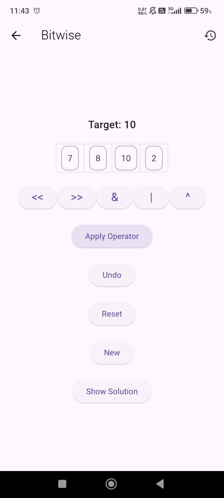

# Team Member
- Muhammad Amin
- Cindi
- Ibra

# Aritmatika
Sebuah pengembangan dari game kartu 24. Game kartu 24 dimulai dengan mengambil 4 kartu dengan As 
bernilai 1 hingga King bernilai 13. Dengan menggunakan operasi tambah, kurang, kali, dan bagi, bentuklah 24. 
Pada game android aritmatika, target angka tidak hanya 24, kartu atau angka tidak hanya 4 dan operasi yang dapat
dilakukan bervariasi

# Tampilan Awal

## Login Page & Register Page

  <table style="margin: 0 auto;">
    <tr>
      <td style="text-align: center;">
        
      </td>
      <td style="text-align: center;">
        
      </td>
    </tr>
  </table>

## Home Page, Drawer, Profile Page

  <table style="margin: 0 auto;">
    <tr>
      <td style="text-align: center;">
        
      </td>
      <td style="text-align: center;">
        
      </td>
      <td style="text-align: center;">
        
      </td>
    </tr>
  </table>

## Home Page, Help Page, Solver Page

  <table style="margin: 0 auto;">
    <tr>
      <td style="text-align: center;">
        
      </td>
      <td style="text-align: center;">
        
      </td>
      <td style="text-align: center;">
        
      </td>
    </tr>
  </table>

## Classic

  <table style="margin: 0 auto;">
    <tr>
      <td style="text-align: center;">
        
      </td>
      <td style="text-align: center;">
        
      </td>
      <td style="text-align: center;">
        
      </td>
      <td style="text-align: center;">
        
      </td>
    </tr>
  </table>

## Bitwise & Random

  <table style="margin: 0 auto;">
    <tr>
      <td style="text-align: center;">
        
      </td>
      <td style="text-align: center;">
        
      </td>
      <td style="text-align: center;">
        
      </td>
      <td style="text-align: center;">
        
      </td>
    </tr>
  </table>

## Timed

  <table style="margin: 0 auto;">
    <tr>
      <td style="text-align: center;">
        
      </td>
      <td style="text-align: center;">
        
      </td>
      <td style="text-align: center;">
        
      </td>
    </tr>
  </table>

# Struktur Database

  <table style="margin: 0 auto;">
    <tr>
      <td style="text-align: center;">
        
      </td>
    </tr>
  </table>

